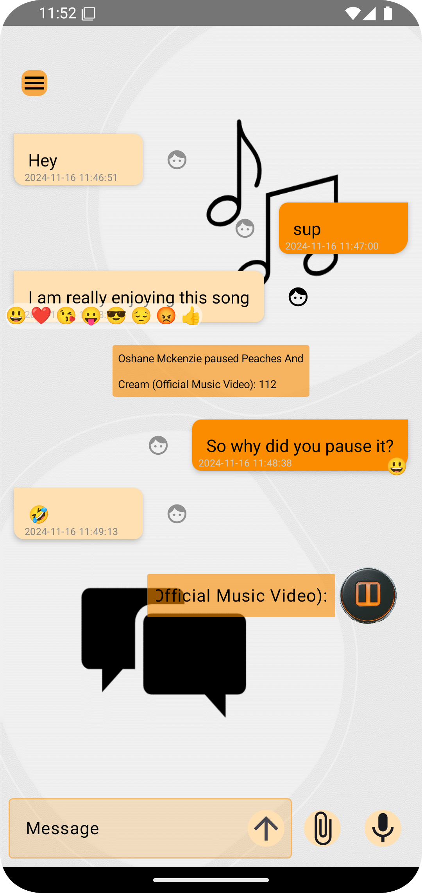
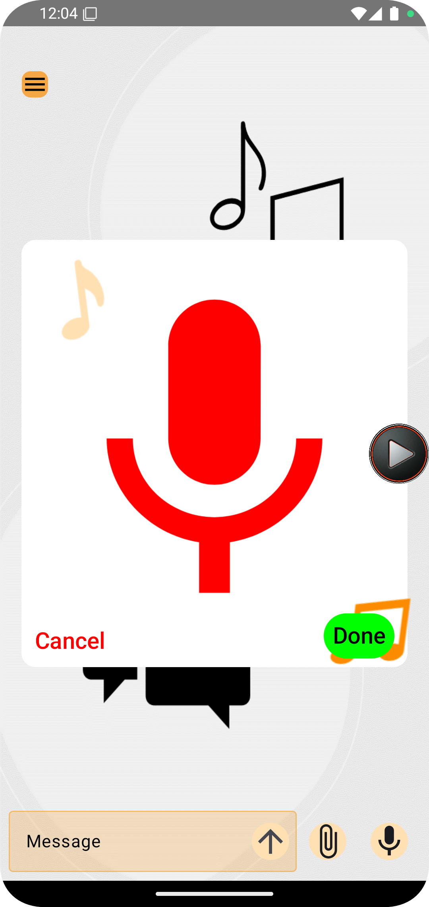
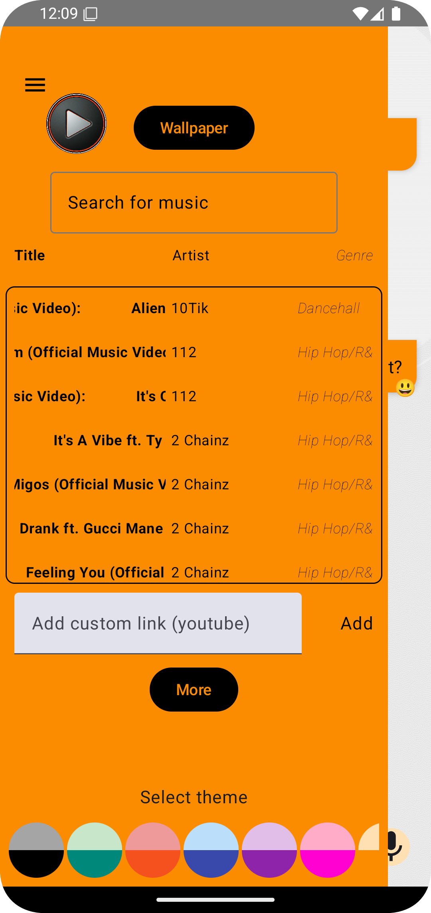
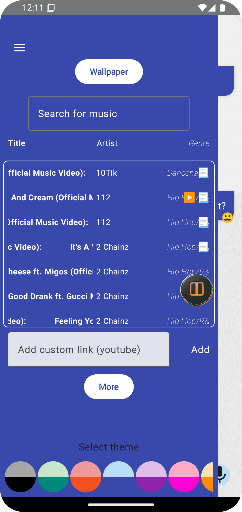
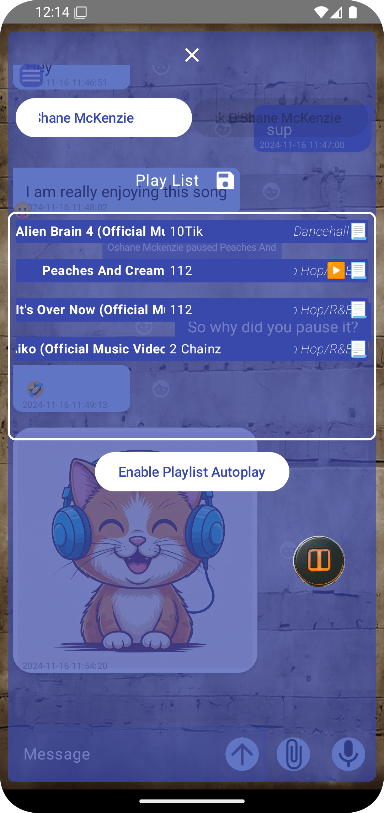
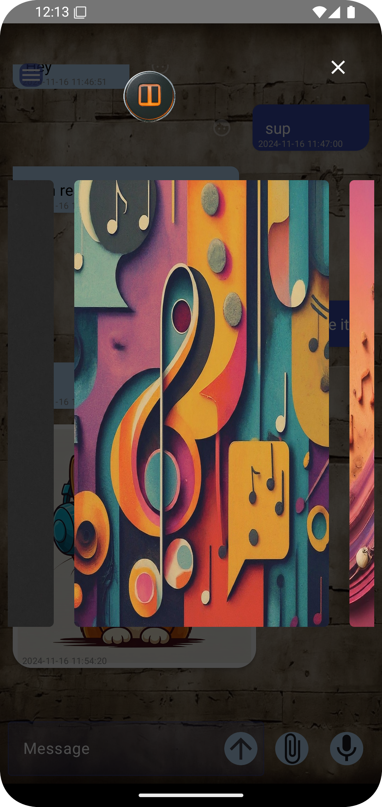
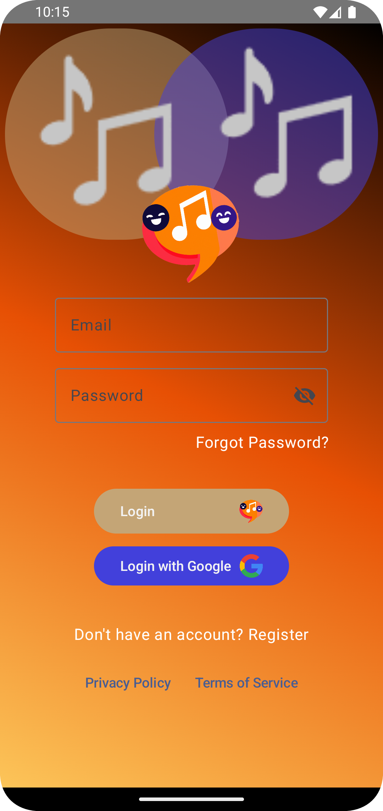

# Tracks - Synchronized Music Messaging


**Version:** 1.0

## Table of Contents
- [About](#about)
- [Features](#features)
- [Screenshots](#screenshots)
- [Building from Source](#building-from-source)
- [Usage](#usage)
- [Technical Details](#technical-details)
- [Support](#support)
- [Contributing](#contributing)
- [License](#license)

## About
*Tracks* is an Android messaging app that reimagines how friends connect through music. By combining instant messaging with synchronized music playback, Tracks creates a unique social experience where two users can chat and enjoy music together in real-time, no matter where they are.

## Features

### Messaging
- 💬 **Rich Messaging**: Send text, images, and voice messages
- 🗑️ **Message Management**: Delete sent messages
- 🚫 **User Controls**: Block/unblock users
- 🔍 **User Discovery**: Search and connect with other Tracks users

### Music Features
- 🎵 **Synchronized Music Playback**: Listen to music simultaneously with your chat partner
- 🎶 **Multiple Music Sources**:
    - Play from Tracks' remote music database
    - Stream music from YouTube links
- 🎧 **Shared Music Controls**:
    - Both users can play, pause, and stop music
    - Skip to next/previous tracks
    - Real-time synchronization of playback state

## Screenshots

### Chat Experience



### Navigation & Music Control



### Music & Playlists



### User Access


## Building from Source

### Requirements
- Android Studio Koala | 2024.1.1 or newer
- JDK 17
- Android SDK API level 26+
- Kotlin Plugin (bundled with Android Studio)
- Jetpack Compose Plugin (bundled with Android Studio)
- Git

### Build Instructions
1. Clone the repository
```bash
git clone https://github.com/OShane-McKenzie/Tracks.git
```

2. Open project in Android Studio

3. Install dependencies
```bash
./gradlew build
```

4. Build the debug APK
```bash
./gradlew assembleDebug
```

The APK will be available in `app/build/outputs/apk/debug/app-debug.apk`

## Usage

### First Time Setup
1. Install the built APK on your Android device
2. Create an account or sign in
3. Grant necessary permissions (microphone for voice messages, storage for media)

### Connecting with Friends
1. Use the search function to find other Tracks users
2. Send a connection request
3. Wait for acceptance to start chatting

### Music Sharing
1. In any chat, open the navigation drawer to:
   - Select a song from Tracks' database
   - Or paste a YouTube link
2. Both users will hear the music in sync
3. Either user can:
   - Play/pause the current track
   - Stop playback
   - Change the song

## Technical Details
- Real-time synchronization
- YouTube API integration for music streaming
- Custom audio streaming protocol for synchronized playback

## Support
- GitHub Issues: [Report bugs or request features]
- Email: oshanemckenzie5@gmail.com

## Contributing
We welcome contributions! Please see our [Contributing Guidelines](CONTRIBUTING.md) for details on:
- Code of Conduct
- Development setup
- Submission process
- Coding standards

## License
Tracks is licensed under the GNU General Public License v3.0 (GPL-3.0). See the [LICENSE](LICENSE) file for details.

This program is free software: you can redistribute it and/or modify it under the terms of the GNU General Public License as published by the Free Software Foundation, either version 3 of the License, or (at your option) any later version.

This program is distributed in the hope that it will be useful, but WITHOUT ANY WARRANTY; without even the implied warranty of MERCHANTABILITY or FITNESS FOR A PARTICULAR PURPOSE. See the GNU General Public License for more details.

---
Made with ♥️ by the Tracks Team